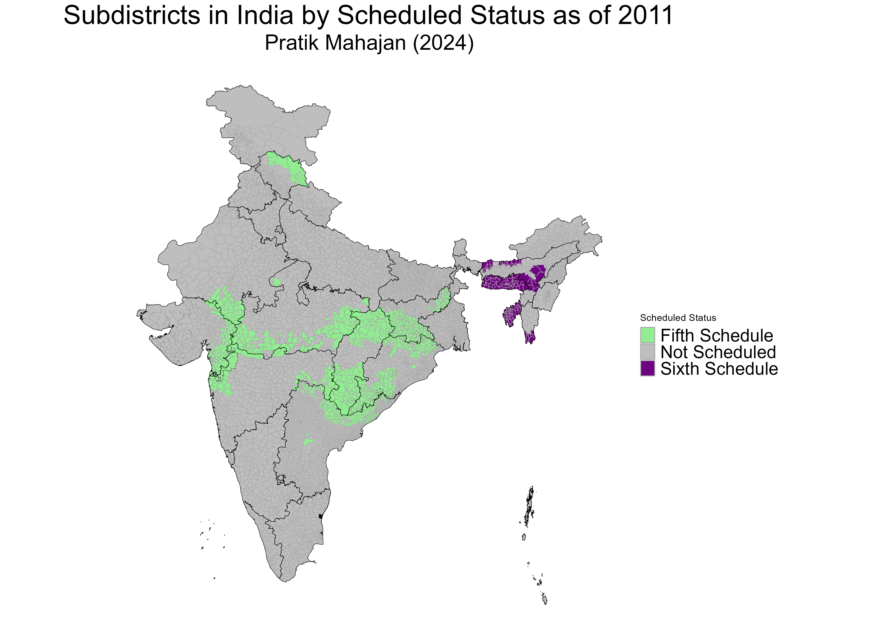

```{=html}
<div class="page-shell">
  <section class="section-block">
    <h2 class="section-title">Published Datasets</h2>
    <div class="feature-layout">
      <figure class="feature-figure">
        
        <figcaption>Scheduled status, spatial matching, and local governance data</figcaption>
      </figure>
      <div class="card-stack">
        <article class="entry-card">
          <h3>Subdistricts of India by Scheduled Status: An Original Dataset Linked to SHRUG</h3>
          <div class="meta-row">
            <span class="pill alt">Development Data Lab, 2024</span>
            <a class="link-pill" href="https://doi.org/10.7910/DVN/2ZKK9U">Harvard Dataverse</a>
            <details class="inline-toggle">
              <summary>Dataset Details</summary>
              <div class="toggle-panel">
                <ul class="clean-list">
                  <li>5969 Indian subdistrict level spatial dataset with information on Fifth and Sixth Scheduled Areas of India.</li>
                  <li>Coded with SHRUG subdistrict spatial indicators for ease of merging with other datasets at the Development Data Lab.</li>
                </ul>
              </div>
            </details>
          </div>
        </article>

        <article class="entry-card">
          <h3>All India SHRUG Shrid (Villages and Towns) Matched to Corresponding Local Governance Bodies Using LGD Codes</h3>
          <div class="meta-row">
            <span class="pill alt">2025</span>
            <a class="link-pill" href="https://dataverse.harvard.edu/dataset.xhtml?persistentId=doi:10.7910/DVN/QVFBFT">Harvard Dataverse</a>
            <details class="inline-toggle">
              <summary>Dataset Details</summary>
              <div class="toggle-panel">
                <ul class="clean-list">
                  <li>This dataset links SHRUG's village and town identifiers to their corresponding local governance bodies using official LGD codes from the Government of India.</li>
                  <li>Each observation is matched to either a Gram Panchayat or an Urban Local Body, enabling governance-level analysis of census and economic data.</li>
                  <li>The matching achieves 90.41% coverage overall, with over 95% accuracy in most major Indian states. Remaining discrepancies are summarized in the documentation.</li>
                </ul>
              </div>
            </details>
          </div>
        </article>
      </div>
    </div>
  </section>
</div>
```
