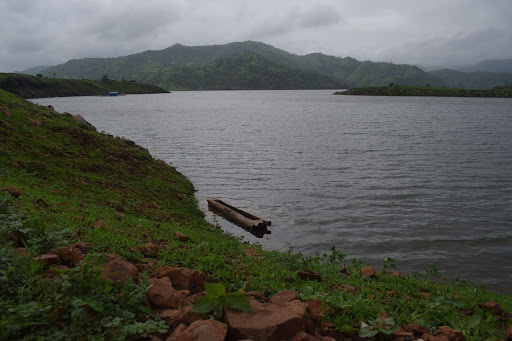

```{=html}
<div class="page-shell">
  <section class="section-block">
    <h2 class="section-title">Field Notes in Images</h2>
    <div class="gallery-grid">
      <figure class="gallery-card wide">
        
        <figcaption>Leading Individual Forest Rights Awareness Meeting in Jalgaon</figcaption>
      </figure>

      <figure class="gallery-card narrow">
        
        <figcaption>Observing a Community Forest Rights Meeting in Jalgaon</figcaption>
      </figure>

      <figure class="gallery-card narrow">
        
        <figcaption>Presenting at APSA 2025 Vancouver</figcaption>
      </figure>

      <figure class="gallery-card wide">
        
        <figcaption>Enumerator Training in Dhule</figcaption>
      </figure>

      <figure class="gallery-card wide">
        
        <figcaption>Organizing Community-Led Enumeration of Individual Forest Rights in Nandurbar</figcaption>
      </figure>

      <figure class="gallery-card narrow">
        
        <figcaption>Being felicitated by tribal leaders before embarking on PhD research</figcaption>
      </figure>

      <figure class="gallery-card narrow">
        
        <figcaption>Observing Adivasi Forest Land Rights Movement, Sakri</figcaption>
      </figure>

      <figure class="gallery-card wide">
        
        <figcaption>The Tranquility of the Narmada Valley</figcaption>
      </figure>
    </div>
  </section>
</div>
```
